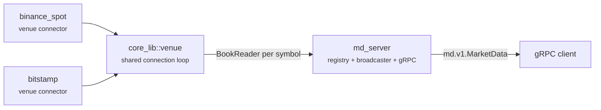

# book_spread

A market-data server that merges order books from multiple venues into one feed per
instrument, and serves it over gRPC.



Each venue connector maintains a live order book per symbol from that venue's own public feed
and publishes the top of book into a lock-free, single-reader buffer. `md_server` reads one of
those per pair, merges every venue quoting an instrument into one book, encodes it once, and
fans it out to every client subscribed to that instrument - one broadcaster owns all of a given
instrument's clients, so a book crosses no channel between the encoder and the wire.

## Crates

| Crate | What it is |
|---|---|
| [`venues/all_venues`](venues/all_venues) | The `Venue` enum every other crate names |
| [`venues/binance_spot`](venues/binance_spot) | Binance Spot connector - see its own README |
| [`venues/bitstamp`](venues/bitstamp) | Bitstamp connector - see its own README |
| [`core_lib`](core_lib) | Shared connector machinery: the connection loop, the instrument registry, the book types, and the lock-free publish/read pair |
| [`md_wire`](md_wire) | The gRPC wire contract - constants, paths, reject codes - shared by server and clients |
| [`md_proto`](md_proto) | Generated `md.v1` message types, from `proto/md.proto` |
| [`md_server`](md_server) | The server: catalogue, registry, broadcaster, gRPC transport |
| `md_client` | A generated tonic client, used by `md_server`'s end-to-end tests. Being reworked - no README yet. |

## Running the server

`md_server` reads its configuration from the file named by `MD_SERVER_CONFIG`:

```sh
MD_SERVER_CONFIG=config.toml cargo run -p md_server
```

`config.toml` and `catalogue.toml` at the repo root are a local, gitignored starting point -
see `md_server::config` for the file's shape and `md_server::catalogue` for what the catalogue
names and why an instrument's index is its position in that file.

## Building and testing

```sh
cargo check --workspace --all-targets --all-features
cargo test --workspace
cargo clippy --workspace --all-targets --all-features
```

`clippy::pedantic` and `clippy::nursery` are on workspace-wide - see the root `Cargo.toml`'s
`[workspace.lints.clippy]` for the exact set and why each override is there.

Some of `core_lib` is also checked under [loom](https://docs.rs/loom) (`--cfg loom`), which
models `shared_buffer` and `atomic_waker` - the lock-free publish/read pair every connector's
book stream is built on - against every interleaving loom knows to try, not just the ones a
live feed happens to produce.
