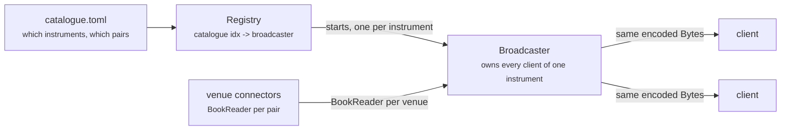

# md_server

A book-feed front end for the venue connectors in `binance_spot` and `bitstamp`, served over
gRPC as `md.v1.MarketData`.



## The one thing this crate is built around

One broadcaster per catalogue instrument owns one `BookReader` per venue quoting it, merges
their books into one, encodes that merged book exactly once, and hands the resulting `Bytes` to
every attached client. A client joining an instrument that is already streaming is added to the
running broadcaster; it never triggers an encode of its own.

The broadcaster owning its clients outright is the point, not an implementation detail. A gRPC
server normally gives each connection a task to drive it; this one doesn't. A broadcaster owns
each client's whole HTTP/2 connection and drives it from its own `select!`, so a book crosses no
channel and no task boundary between the encoder and the wire, and the same `Bytes` reaches
every client with no per-client copy. The cost is that writes for one instrument are serialised
on one task - if an instrument ever outgrows that, the fix is sharding it across a second
broadcaster, not reintroducing a hop.

`crate::client` is what keeps that arrangement honest: everything above the transport works
against three traits (`Handshaker`, `ClientHandshake`, `ClientSink`), and `crate::grpc` is the
only module that knows the wire is HTTP/2 at all - a test can watch one book reach three clients
without running three HPACK handshakes to see it.

## What a client may ask for

`crate::catalogue`: a file read once at startup, naming every instrument this server serves and
which venue quotes each side of it. An instrument's index is its *position* in that file, not a
number the file spells out - so a client always names the pairs it thinks that index carries
alongside the index itself, and a subscribe against a stale index is refused as
`InstrumentChanged` rather than silently serving the wrong book. See `crate::catalogue`'s module
doc for the numbering rule and `crate::registry::Registry::subscribe` for the check.

Symbols are subscribed on demand, per instrument: the first client subscribes every one of its
pairs on that pair's connector, and the last client to leave releases them all.

## Request lifecycle

1. **`crate::transport`** accepts a connection - generic over `Listener`, so tests swap in a
   mock that never touches a socket.
2. **`crate::framed`** hands the accepted stream to a `Handshaker`, which turns it into a
   `Route`: a subscribe naming an instrument, or a catalogue request. This is the *only* place a
   connection has a task of its own - once handed to a broadcaster, nothing here touches it
   again.
3. **`crate::registry`** looks the index up against the catalogue, resolves its pairs against
   what the connectors have interned, and either joins a running broadcaster or starts one.
4. **`crate::broadcast`** is the running broadcaster: merges every venue's book
   (`book_merger`), encodes it once (`book_encoder`), and writes it to every session
   (`session`) it owns, all from one `select!` loop reached through one queue (`queue`).
5. **`crate::grpc`** is where any of this finally becomes HTTP/2 - framing, HPACK, and one
   stream per connection so a broadcaster can drive a client's connection directly rather than
   handing it a task.

## Configuration

`crate::config::AppConfig` is read from the file `MD_SERVER_CONFIG` names - see that module's
doc for the file's shape. Every section but the catalogue path is optional; an omitted venue
section runs on that venue's own defaults.

```toml
addr = "0.0.0.0:50051"

[catalogue]
path = "catalogue.toml"

[venues.binance_spot]
rest_endpoint   = "https://api.binance.com"
stream_endpoint = "wss://data-stream.binance.vision"
depth_speed     = "fast"
snapshot_limit  = 100
[venues.binance_spot.core]
max_backoff         = "30s"
idle_symbol_timeout = "60s"
idle_scan_interval  = "10s"

[venues.bitstamp]
rest_endpoint   = "https://www.bitstamp.net"
stream_endpoint = "wss://ws.bitstamp.net"
```

The catalogue itself is a separate TOML file - what this server advertises and will serve, one
`[[instruments]]` table per instrument, each naming the pairs that merge into it:

```toml
# USDT/USD - both venues quote it
[[instruments]]
pairs = [
    { venue = "binance_spot", symbol = "USDTUSD" },
    { venue = "bitstamp", symbol = "usdtusd" },
]

# BTC/EUR
[[instruments]]
pairs = [
    { venue = "binance_spot", symbol = "BTCEUR" },
    { venue = "bitstamp", symbol = "btceur" },
]
```

An instrument's index - what a client names in a subscribe - is its *position* in this file,
counting from zero, so entries are appended rather than inserted; a symbol is each venue's own
spelling, never normalised. See `crate::catalogue`'s module doc for the full numbering rule and
`crate::catalogue::source` for the loader. `config.toml` and `catalogue.toml` at the repo root
are a gitignored, ready-to-run pair built to this shape - see the workspace README.

## Where the code lives

| Module | Responsibility |
|---|---|
| `server` | Wiring and shutdown ordering: bind, load the catalogue, serve until ctrl-c |
| `config` | `AppConfig`, read from `MD_SERVER_CONFIG` |
| `catalogue` | The instrument file, its index numbering, and matching a subscribe's claimed pairs against it |
| `registry` | Catalogue index -> broadcaster, and the two races around starting and stopping one |
| `broadcast` | The running broadcaster: merging, encoding, and writing to every attached session |
| `client` | The three transport-agnostic traits everything above the wire is built against |
| `grpc` | The one module that knows the transport is HTTP/2, built on `h2` |
| `framed` | Accepting a connection and handshaking it onto a broadcaster |
| `transport` | The seam between the accept loop and whatever actually listens |
| `venue` | The slice of a connector the fan-out layer actually uses, and `LiveConnectors` over the real `binance_spot`/`bitstamp` handles |
| `encode` | Wire encoding shared across `catalogue` and `broadcast` |
| `test_util` | In-memory doubles used by this crate's own tests and by `tests/end_to_end.rs` |

`main.rs` is deliberately thin: it installs jemalloc as the global allocator, reads
`AppConfig::from_env`, and calls `server::run` - everything else lives in the library target so
`tests/end_to_end.rs` can exercise it over a real gRPC client without a second binary.

## Testing

```sh
cargo test -p md_server                    # unit tests, mocked transport and connectors
cargo test -p md_server --test end_to_end  # a real gRPC client over a real socket
```

The end-to-end suite drives the hand-written server with a tonic client generated from the same
`.proto` (`md_client`, a dev-dependency here), which is what proves this is gRPC rather than
something merely gRPC-shaped.
