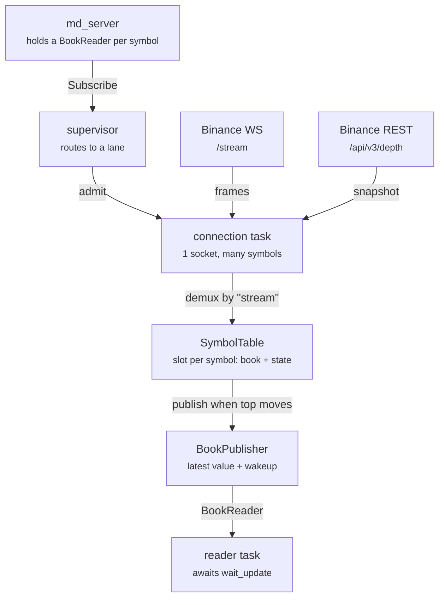
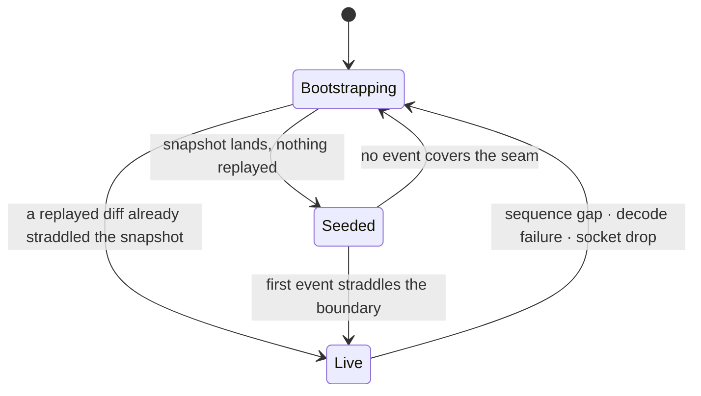

# Binance Spot Book Connector

Maintains a live order book per symbol from Binance's public depth feed, and publishes the top
of book into a lock-free buffer for another task to read. No account, no API key, no signing.

| | |
|---|---|
| Transport | keyless JSON, `wss://data-stream.binance.vision/stream` |
| Symbols per socket | 200 (Binance allows 1024) |
| Allocation per frame | none |
| Book depth published | 10 levels each side |
| Snapshot request weight | 5 |

---

## What it does

Binance publishes order book changes as a stream of incremental diffs. A diff only says "price
64437.42 now has quantity 2.0" — it carries no notion of the whole book, and it is only
meaningful applied in exact sequence on top of a snapshot. This connector does that bookkeeping:
it fetches a snapshot, applies every diff in order, detects when it has missed one, and rebuilds
when it has.

What comes out is a `SmallBook` — the best 10 bids and 10 asks — published through a
`BookPublisher` every time the top of book actually moves, which both stores the latest value and
wakes the reader. A reader task awaits `wait_update` and reads that value. The connector's job
ends there; it has no opinion about what the reader does.

### Why JSON rather than SBE

Binance also offers the same market data in SBE, a binary encoding that would parse faster. It
is unusable here: the SBE streams require an Ed25519 API key in the `X-MBX-APIKEY` header, so
they cannot be reached without an account. The JSON streams on `data-stream.binance.vision`
carry identical depth data and need no credentials at all, so that is what the connector uses.

---

## How data flows

A caller sends the connector a symbol and gets back the `BookReader` for it. The connector packs
symbols onto shared WebSocket connections, demultiplexes the incoming frames back out to
per-symbol books, and publishes.



### One socket carries many symbols

The connector connects to `/stream` rather than `/ws`, because `/stream` wraps every event with
the stream that produced it:

```jsonc
// combined-stream envelope
{"stream":"btcusdt@depth@100ms","data":{"e":"depthUpdate","U":157,"u":160, ...}}
```

That `"stream"` field is the demux key, and it arrives **first** — which the decoder relies on
to route a frame before touching any price level. Symbols join a live socket through
`SUBSCRIBE` control frames, so the subscription queue can keep growing a connection that is
already running.

Binance allows 1024 streams per connection. The connector caps a socket at 200 and lets the
supervisor open another one, so a single dropped socket forces a bounded number of symbols to
rebuild rather than all of them.

---

## Bringing a book to life

This is the one genuinely sequential part of the system, and the one with the most ways to go
subtly wrong. A diff stream alone is useless — it has to be anchored to a snapshot, and the seam
between the two is where books get silently corrupted.

1. **Subscribe, then buffer.** The symbol gets a slot and a `SUBSCRIBE` frame, but no snapshot is
   requested yet. Incoming diffs are parsed on arrival into the slot's own arena — their `U`/`u`
   and their levels, side by side in one flat buffer — because there is no book to apply them to
   yet. They are *not* kept as raw JSON for a second parse later: simd-json unescapes strings into
   its own input buffer, so re-parsing a payload that contained an escape would fail outright.

2. **Note the first event's `U`.** The snapshot must reach at least this far, or there is a hole
   between the two that no replay can close — and when it doesn't reach, the bootstrap fetches
   another snapshot against the same buffered diffs instead of starting over, so that bar never
   moves. Only a hole *between* two buffered diffs — a frame the socket dropped, which no
   snapshot can fill in — throws the buffer away and restarts. Binance's REST depth is generated
   live rather than cached, so the refetch path is effectively unused here; it exists because
   the recovery lives in the shared connection loop, and because a REST replica lagging the
   stream by even one update would otherwise livelock the symbol.
   This is why the fetch waits for the first frame
   rather than firing at subscribe time.

3. **Fetch the snapshot.** `GET /api/v3/depth?symbol=BTCUSDT&limit=100`. The response seeds the
   book directly. `limit=100` costs request weight 5 against a 6000/min budget, where
   `limit=5000` would cost 250 — and 100 levels is a generous tail behind a 10-level publish.

4. **Discard what the snapshot already contains.** Any buffered event whose `u` is at or below
   the snapshot's `lastUpdateId` is already reflected in the book and is dropped untouched.

5. **Check the seam.** The first event actually applied must straddle the boundary:
   `U <= lastUpdateId + 1 <= u`. If nothing straddles it, the snapshot and the stream do not
   meet, and the bootstrap restarts.

6. **Go live.** From here every event must satisfy `U == prev_u + 1` exactly. Anything else is a
   gap, and a gap means the book can no longer be trusted.

> **The snapshot is often ahead of the socket.** REST reflects the book as of now, while the
> WebSocket may still be delivering diffs from a moment ago. So a freshly seeded book routinely
> receives events it already contains, and demanding strict sequencing immediately would throw
> away a perfectly good book. That is what the `Seeded` state below exists to handle — it was a
> real bug, caught only against the live feed.

---

## The three states of a symbol

Every symbol on a connection sits in exactly one of three states, and that state decides how the
next frame for it is interpreted. There is one decoder outcome per state, so nothing has to
re-inspect the slot after decoding.



| State | Meaning |
|---|---|
| `Bootstrapping { pending, first_id, fetching }` | No usable book. Diffs pile up parsed, in the slot's own arena, capped at 512 of them. Readers see an empty book. The snapshot fetch starts on the first frame to arrive. |
| `Seeded { last_update_id }` | Book exists, nothing applied on top of it. Events at or below `last_update_id` are dropped as already-included; the first to straddle the boundary promotes the slot. |
| `Live { prev_u }` | Book is current. Every event must continue the sequence exactly. The only state where a mismatch counts as a gap. |

Every recovery path discards the book, publishes an empty one, and starts over.

---

## Decoding without allocating

A frame arrives every 100 ms per symbol, so decoding is the hot path. It performs no heap
allocation at all: no intermediate model, no vector of levels, no owned strings. That comes from
`serde`'s `DeserializeSeed`, which lets a decoder carry `&mut IncrementalBook` into the parse and
apply each price level at the moment it is read.

```text
MuxSeed          — reads "stream"
 └ StreamLookup  — routes the stream's symbol prefix to a slot
    └ SlotSeed   — picks a decoder from the slot's state
       ├ IdsSeed  — Bootstrapping: skip the body, keep U and u
       └ DiffSeed — Seeded / Live: apply levels as they parse
          └ LevelsSeed → apply_level(book, side, price, qty)
```

The demux key is the stream name's *symbol* prefix (`btcusdt`, out of `btcusdt@depth@100ms`),
not the stream name itself - which is also how `SymbolTable` is keyed.

Two supporting details make it allocation-free. `Decimal` parses a price out of a transient
`&str` straight into `f64`, so the decoder never depends on the parser handing back *borrowed*
strings — which is not guaranteed for escaped input. And the per-connection scratch buffer plus
`simd_json::Buffers` are reused for the life of the socket, since simd-json rewrites its input in
place.

### Two message shapes, told apart by the first key

The socket carries envelopes and control replies, which share no fields. The decoder reads the
first key and dispatches: `stream` means envelope, anything else means reply. That makes "the
stream is known before any level is touched" a property of the parse rather than a check that
could be forgotten. Each branch then reads keys through its own enum — `EnvelopeField` and
`ControlField` — so neither can express the other's fields.

A reply is a rejection when it carries an `error` key (or a top-level `code`) that is not null,
whatever shape that value turns out to have. The exact rejection envelope is not confirmed
against a live socket — the symbol listing now filters out the easy way to provoke one — so the
decode of that value is deliberately total: null, a string, an array, an object with no `code`,
a code quoted as a string, all decode. A shape it does not recognize costs the numeric reason in
the log line and nothing else. Getting this wrong in the other direction would be worse than the
silent swallow it replaced: a reply that failed to decode would produce one `undecodable frame`
warning per rejection, on every reconnect.

### Zero quantity means delete

Binance signals a removed level by sending quantity `0`. `IncrementalBook` has no such rule, so
the connector applies it — and inspects the quantity *before* building a `PositiveF64` from it,
because on the delete path there is no size to represent and a zero-size level is something the
book should never hold.

---

## When to publish

A published `SmallBook` is 10 levels deep, but a diff frequently only touches levels far below
that. `IncrementalBook` reports which tier changed — `Close` for the hot top, `Deap` for the deep
tail, `Both` — and the connector merges that across every level in the event, then publishes only
for `Close` or `Both`.

A deep-only event therefore costs no snapshot build, no slot write, and no reader wakeup. Measured
against the live feed, roughly 40% of events are suppressed this way: two symbols over 45 seconds
produced about 520 events and 306 publishes.

---

## When things go wrong

Failures are separated by blast radius, and the type system carries the distinction rather than a
runtime check: returning a `BootstrapError` resyncs one symbol, returning a `SessionError`
reconnects the socket.

**One symbol.** A sequence gap, a malformed body, or a snapshot that cannot be joined to the
stream. The book is cleared, an empty book is published so readers stop acting on stale levels,
and that symbol alone rebootstraps. Its neighbours on the same socket keep streaming.

**The whole socket.** A transport error, or the 24-hour connection limit Binance enforces. Every
symbol on it returns to `Bootstrapping` and the socket reconnects with exponential backoff plus
jitter, resetting after any session that lasted a minute. The 24-hour close is treated as
routine, not a failure.

Attributing a mid-body failure needs care, because levels are applied as they parse: a frame that
fails halfway through has already half-updated one book. The decoder hands the slot back
alongside the error, and only when it had already entered the body — a stream that resolved but
whose envelope carried no data blames nothing. There is no mark stored anywhere that could go
stale and blame the wrong symbol later.

### Error types

| Type | Scope |
|---|---|
| `InvalidSymbol` | A symbol name that is empty or not ASCII alphanumeric. A struct, not an enum: one failure mode. |
| `MalformedPayload` | Payload conditions raised inside a `serde` visitor, so they surface as the message inside a `simd_json::Error`. |
| `SnapshotFetchError` | The REST snapshot request. |
| `BootstrapError` | Seeding and replay. Always symbol-local. |
| `SessionError` | The socket. Always connection-wide. |

---

## Budgets the design is shaped by

Most of the non-obvious choices in the connector exist to stay inside one of these.

| Limit | Binance | What the connector does |
|---|---|---|
| Streams per connection | 1024 | Caps at 200 so one socket failure has a bounded blast radius |
| Incoming messages | 5 / sec | Coalesces queued subscriptions into one `SUBSCRIBE`; paces control frames 250 ms apart |
| Connection lifetime | 24 h | Treats the close as clean, reconnects immediately, resubscribes in batches |
| REST request weight | 6000 / min | `limit=100` costs 5, not 250; at most 8 snapshots in flight |
| Server ping | every 20 s | Answered automatically, provided the read half keeps being polled |

---

## What a reader needs to know

- **It is a latest-value buffer, not a queue.** A reader that falls behind does not build a
  backlog — it silently misses intermediate books and sees only the most recent one. That is the
  intended trade for a fixed-size, lock-free handoff.
- **An empty book means "no book".** It covers both resyncing and the state before the first
  publish. It is also what the publisher leaves behind when it goes away — but that case is not
  ambiguous, because `wait_update` returns `None` from then on.
- **The wakeup is separate from the data.** `wait_update` says something was published;
  `get_last` provides what. Nothing couples them, so a reader must not assume one wakeup equals
  one book.
- **`PositiveF64` has no accessor.** Prices and sizes come out of `SmallBook` as an opaque ordered
  type. The connector never needs the inner `f64`; a real consumer will.

### Using it

```rust
use binance_spot::BinanceSpot;
use core_lib::connector::ConnectorHandle;
use core_lib::venue::ConnectorConfig;

// The crate's own `Config` is just this venue's extras — endpoints and wire-format
// knobs. `ConnectorConfig` pairs it with the shared `CoreConfig`, and its `Default`
// picks up this venue's overrides for both halves.
let handle = ConnectorHandle::new::<BinanceSpot>(ConnectorConfig::default());

let mut reader = handle.subscribe("BTCUSDT".into()).await??;

while reader.wait_update().await.is_some() {
    let book = reader.get_last();
    // book.bids(), book.asks()
}

handle.shutdown().await;
```

The connector builds the publisher and hands the `BookReader` back over the request's reply
channel, so a rejected symbol surfaces as an `Err` instead of a book that never arrives. The pair
is single-producer / single-consumer: one reader per symbol, and it cannot be cloned.

A symbol is checked against Binance's own listing before a lane is chosen: `GET
/api/v3/exchangeInfo` is fetched at startup and again on every wall-clock hour, and only symbols
whose `status` is `TRADING` are subscribable. Anything else is refused up front rather than
discovered from a control-frame rejection, and a symbol that disappears from a later refresh is
torn down — its reader sees the empty-book sentinel and then `None`, the same as an explicit
unsubscribe. The listing is fail-closed: nothing is routed until one has been fetched, and a
request that beats the first fetch waits for it rather than being refused.

`ConnectorHandle::shutdown` closes every socket and waits for it, and readers see the empty-book
sentinel followed by `None` from `wait_update`.

---

## Where the code lives

This crate is only the Binance-specific half. The connection loop, slot table, supervisor,
REST fetch and symbol listing are all generic and live in `core_lib::venue` — see that module's
doc for why the split landed where it did.

| File | Responsibility |
|---|---|
| `lib.rs` | Public surface: `BinanceSpot`'s `Connector` and `Venue` impls, and `Config` — this venue's extras, which a caller wraps in `core_lib`'s `ConnectorConfig` |
| `decode.rs` | The seed chain, the `Buffered` arena a bootstrapping symbol stages diffs into, `on_frame`/`seed_and_replay`, the `exchangeInfo` listing, and the rule that zero quantity deletes |
| `pacer.rs` | `BatchPacer`: chunks `SUBSCRIBE`/`UNSUBSCRIBE` names into one frame per run and paces them 250 ms apart |
| `symbol.rs` | Stream-name construction on top of `core_lib`'s `Symbol`, and `DepthSpeed` |
| `subscription.rs` | Binance's own tunables, and its `CoreConfig` defaults via `Defaults` |

What it gets from `core_lib::venue`:

| Module | Responsibility |
|---|---|
| `spec.rs` | The `Venue` trait itself, `FrameAction`, `Retry`, `ControlPacer`, `Decoder` |
| `connection.rs` | One socket: the session loop, admitting symbols, bootstrap and its two recoveries, the idle and stall watchdogs, backoff |
| `supervisor.rs` | Reads the subscription queue, checks each symbol against the listing, routes it to a connection with room, and owns connection shutdown |
| `router.rs` | Which connection carries which symbol, connector-wide |
| `table.rs` | `SlotTable`, per-symbol `Slot` and its state machine |
| `pending.rs` | The `PendingDiffs` trait — what a venue's bootstrap arena has to offer |
| `levels.rs` | Decimal and price-level decoding, shared with `bitstamp` |
| `rest.rs` / `universe.rs` | The snapshot fetch and its concurrency limit; the hourly symbol listing |
| `config.rs` | `CoreConfig`, `ConnectorConfig`, `Defaults` |
| `session.rs` / `backoff.rs` / `scratch.rs` | Session end and the close handshake, retry pacing, the JSON scratch buffer |

The error types live next to what raises them, not in `lib.rs`. This crate's are all in
`decode.rs`: `BootstrapError` and `SymbolsError` are public, `MalformedPayload` private. The
shared ones are `core_lib`'s — `SessionError` in `session.rs`, `SnapshotFetchError` in `spec.rs`,
`ListingError` in `universe.rs`, `MalformedDecimal` in `levels.rs`.

The book itself is not here. `IncrementalBook`, `SmallBook` and the `BookPublisher`/`BookReader`
pair live in `core_lib`, as does the `Connector` trait this crate implements; the connector only
feeds them.

---

## Known gaps

- **The rejection envelope is unverified against a live socket.** The symbol listing now filters
  out the easy way to provoke one, so the `{"error":{"code","msg"},"id"}` shape has not been seen
  on the wire. The decode of that value is total, so a shape it does not recognize costs the
  numeric reason in the log line and nothing else — but the reason itself is a guess.
- **Snapshot fetches in flight at shutdown are detached and finish into a dropped channel.** They
  are not awaited: `stop_connections` aborts the connection tasks, but a fetch is its own spawned
  task and only `Slot::abort_fetch` cancels one.
- **NaN is only caught in debug builds.** Prices go through `PositiveF64::new_unchecked` behind a
  `debug_assert!`. A literal `NaN` in the feed is the one input that would be genuine undefined
  behaviour.

---

Describes the connector as built and verified against the live feed: twelve symbols on one
socket, bootstrapped and live within two seconds of connecting, no sequence gaps. Covered by 32
tests in `binance_spot` and 80 in `core_lib`.
