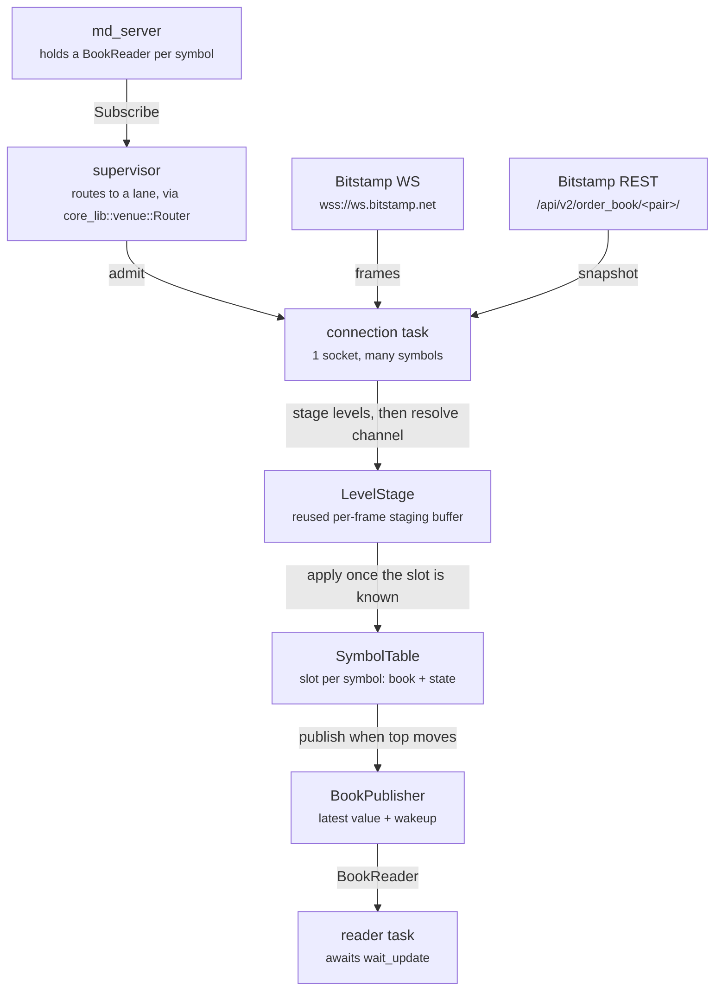
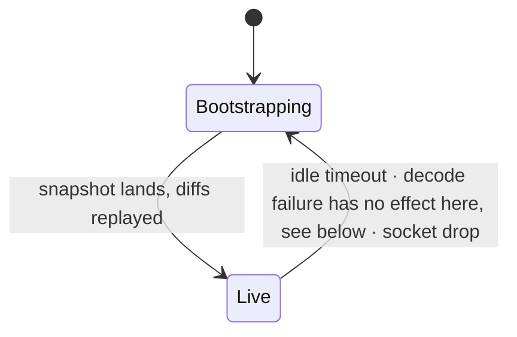

# Bitstamp Spot Book Connector

Maintains a live order book per symbol from Bitstamp's public `diff_order_book` feed, and
publishes the top of book into a lock-free buffer for another task to read. No account, no API
key, no signing. Built to the same architecture as `binance_spot`, on shared pieces now living in
`core_lib::venue` — see that module's doc for exactly which pieces those are and why the rest
stayed put.

| | |
|---|---|
| Transport | keyless JSON, `wss://ws.bitstamp.net` (root path — no `/stream` equivalent) |
| Channels per socket | 100 (Bitstamp documents no cap; this is a blast-radius choice) |
| Allocation per frame | none in steady state, but see "Decoding" below — this venue is not allocation-free of an intermediate model the way Binance is |
| Book depth published | 10 levels each side |
| Snapshot cost | the whole book, ~155 KB, ~2900 levels per side — Bitstamp's `limit` parameter does not exist |

---

## What it does

Bitstamp publishes order book changes as a stream of incremental diffs on
`diff_order_book_<pair>`. A diff only says "price 78241.31 now has quantity 0" — it carries no
notion of the whole book, and it is only meaningful applied on top of a snapshot. This connector
does that bookkeeping: it fetches a snapshot, applies every diff past it, and republishes the top
of book whenever it moves.

Two things separate this from Binance's connector, both forced by the wire, not chosen:

1. **The envelope names the channel last, not first.** Binance's combined-stream frame is
   `{"stream": "...", "data": {...}}` — the demux key arrives before the levels, so the decoder
   resolves the target book before parsing a single one. Bitstamp's frame is `{"data": {...},
   "channel": "...", "event": "data"}` — the levels arrive *before* the channel name that says
   which book they belong to. See "Decoding" below for what that costs.
2. **There is no sequence number.** Bitstamp gives only a `microtimestamp` per frame, not
   Binance's `U`/`u` pair. There is nothing to detect a dropped frame with directly — see "The
   two states of a symbol" and "When things go wrong" below.

---

## How data flows

A caller sends the connector a symbol and gets back the `BookReader` for it. The connector packs
symbols onto shared WebSocket connections, demultiplexes the incoming frames back out to
per-symbol books, and publishes.



### One socket carries many symbols, one channel per control frame

Symbols join a live socket through `bts:subscribe` control frames, so the subscription queue can
keep growing a connection that is already running — exactly as in `binance_spot`. What differs:
Bitstamp names exactly one channel per control message, so there is no batching to fall back on
the way Binance's `SUBSCRIBE` (many streams in one frame) does. Admitting N symbols costs N
frames. Rather than blocking the read half on a sleep per frame — which would stall reading for
`N * control_gap` — the connection owns a queue of pending control frames and drains one per tick
of a timer, without the read half ever stalling.

---

## Bringing a book to life

1. **Subscribe, then buffer.** The symbol gets a slot and a `bts:subscribe` frame, but no snapshot
   is requested yet. Incoming diffs are parsed on arrival: the levels land in the connection-wide
   stage (the channel name only arrives after the data), and are then copied into the slot's own
   arena once that channel resolves. They are *not* kept as raw JSON for a second parse later:
   simd-json unescapes strings into its own input buffer, so re-parsing a payload that contained
   an escape would fail outright.

2. **Note the first diff's microtimestamp.** The snapshot must reach at least this far, or there
   is a window between them whose changes were never seen. When it doesn't, the bootstrap asks
   for *another snapshot against the same buffered diffs* rather than starting over — see below.
   That bar has to stay put: restarting re-arms it from the next diff to arrive, and Bitstamp
   serves `order_book` from a cache that advances about once a second while its diff stream
   advances continuously, so the bar would outrun the snapshot indefinitely. Before this was
   split out, lower-volume pairs cycled for tens of seconds without ever getting a book; a live
   run now bootstraps all six with zero restarts and at most four refetches on any one pair.

3. **Fetch the snapshot.** `GET /api/v2/order_book/<pair>/`. There is no depth parameter — the
   response is the whole book, ~155 KB. That is the single biggest cost difference from Binance,
   and why `max_concurrent_snapshots` defaults to 4 rather than 8.

4. **Discard what the snapshot already contains.** Any buffered diff at or before the snapshot's
   microtimestamp is already reflected in the book and is dropped untouched.

5. **Apply the rest, in order.** Unlike Binance, nothing has to straddle a boundary: once the
   snapshot is known good, any diff past it simply applies. There is no `Seeded` state waiting
   for a seam to close.

6. **Go live.** From here a diff applies if its microtimestamp is greater than the last one
   applied; otherwise it is dropped as a duplicate — the only sequencing check left once there is
   no `U`/`u` pair to demand exact contiguity from.

---

## The two states of a symbol

Binance's slot has three states because a snapshot that outruns the socket needs a `Seeded` phase
waiting for the first event to straddle the boundary. Bitstamp's snapshot sync rule doesn't need
that: once the snapshot is validated against the earliest buffered diff, every later diff simply
applies in order, so there is nothing to wait for.



| State | Meaning |
|---|---|
| `Bootstrapping { pending, first_micro, fetching }` | No usable book. Diffs pile up parsed, in the slot's own arena, capped at 512 of them. Readers see an empty book. |
| `Live { last_micro }` | Book is current. A diff applies if its microtimestamp is greater than `last_micro`; otherwise it is dropped as a duplicate. |

Every recovery path discards the book, publishes an empty one, and starts over.

---

## Decoding: why it stages instead of applying directly

Binance's decoder applies each price level the moment it is parsed, because the stream name — the
demux key — arrives first. Bitstamp's `data` object arrives *before* `channel`, so the target book
is genuinely unknown while the levels are being read. The decoder therefore runs in two phases:

```text
FrameSeed        — visits data / channel / event in whatever order they arrive
 └ DataSeed      — parses "data" into the reusable LevelStage
    └ LevelsIntoStage → stage.push(price, qty)
 (channel resolves once seen) → Frame::Data { slot, micro } or Frame::Buffer { slot, micro }
```

`LevelStage` holds one `Vec<(f64, f64)>` plus a split index — `[..split]` is bids, `[split..]` is
asks — rather than two `Vec`s or a flag recording which side came first. Side order is fixed:
Bitstamp sends `bids` before `asks`, and a payload that breaks that order is rejected as
`MalformedPayload::FieldOrder` rather than being reordered. Once the channel resolves, `on_frame`
either applies the staged levels onto the resolved book — for a slot that already has one — or
copies them into that slot's own `Buffered` arena, to be replayed after its snapshot lands.

This is still allocation-free in steady state — the stage's `Vec` is reused every frame, and
diffs are tiny — but it is a real intermediate model where Binance has none, and that is a forced
departure, not an oversight. One consequence is a genuine simplification: because levels only ever
land in the stage during decode, never in a book, a mid-frame decode failure can never leave a
book half-updated. Binance's `EnvelopeError`/`processed_slot` error-attribution machinery — which
exists purely to figure out which book a failed decode might have half-written — has no
counterpart here at all.

### Zero quantity means delete

Same rule as Binance: a level with quantity `0` is a delete, applied by inspecting the quantity
before building a `PositiveF64` from it, since a zero-size level is something the book should
never hold.

---

## When to publish

Same gate as Binance: `IncrementalBook` reports which tier a level touched — `Close` for the hot
top, `Deap` for the deep tail, `Both` — merged across every staged level, and the connector
publishes only for `Close` or `Both`. A diff that only moves levels below the hot tier costs no
publish and no reader wakeup.

---

## When things go wrong

**One symbol.** A decode failure, or an idle timeout with no diff. The book is cleared, an empty
book is published, and that symbol alone rebootstraps. Its neighbours on the same socket keep
streaming.

A decode failure specifically needs no slot-blaming logic at all — see "Decoding" above. It is
simply logged and the frame is dropped; nothing was ever half-applied, so there is nothing to
resync because of it. A resync only happens if the *channel itself* couldn't be resolved to a
slot, in which case there was no slot to touch in the first place.

**The idle watchdog: the only defence against a dropped frame.** Bitstamp carries no sequence id,
so a lost frame is undetectable in the data itself — the microtimestamp only tells you a diff is
*newer*, never that one is *missing*. Every `idle_scan_interval`, any slot whose last diff is
older than `idle_timeout` is resynced on the assumption that a feed this quiet for this long more
likely lost a frame than went genuinely silent. This is a real gap, not a full substitute for
sequence checking: a symbol that drops one frame and then immediately gets a fresh one within
`idle_timeout` is never caught. `idle_timeout` is deliberately generous (60s default) because a
false resync costs a ~155 KB fetch, and an illiquid pair can legitimately go quiet.

**The whole socket.** A transport error, or `bts:request_reconnect` — treated exactly like
Binance's 24-hour close: routine, not a failure, and the backoff resets rather than escalating.
Every symbol on the socket returns to `Bootstrapping` and the socket reconnects with exponential
backoff plus jitter.

**`bts:error` can only be attributed by guesswork.** It carries neither a request id nor a
channel, so the rejection is logged at `error!` with its message plus the channel of the last
control frame sent — a good guess, since exactly one goes out per 50 ms and Bitstamp answers
promptly, but a guess. The real guard against a bad symbol is the listing check below, which
refuses it before a control frame is ever sent.

### The symbol listing

`GET /api/v2/trading-pairs-info/` is fetched at startup and again on every wall-clock hour, and
only pairs whose `trading` is `Enabled` are subscribable. A subscribe for anything else is
answered with an `Err` on its reply channel before a lane is chosen, and a pair that disappears
from a later refresh is torn down — its reader sees the empty-book sentinel and then `None`, the
same as an explicit unsubscribe. The listing is fail-closed: nothing is routed until one has been
fetched, and a request that beats the first fetch waits for it rather than being refused. A failed
refresh retries with the shared backoff and leaves the last good listing in place.

### Error types

| Type | Scope |
|---|---|
| `InvalidSymbol` | A symbol name that is empty or not ASCII alphanumeric. |
| `MalformedPayload` | Payload conditions raised inside a `serde` visitor; surfaces as the message inside a `simd_json::Error`. No `Gap` variant — there is no sequence id to gap on. |
| `SnapshotFetchError` | The REST snapshot request. |
| `BootstrapError` | Seeding and replay. Always symbol-local. Only one variant beyond fetch/decode failure: `SnapshotGap`. |
| `SessionError` | The socket. Always connection-wide. |

---

## Budgets the design is shaped by

| Limit | Bitstamp | What the connector does |
|---|---|---|
| Channels per connection | none documented | Caps at 100 anyway, since one socket failure re-snapshots every symbol on it at ~155 KB each |
| REST rate | 400 req/s, 10 000 / 10 min | Generous; the real constraint is bandwidth and parse time, so `max_concurrent_snapshots` defaults to 4 |
| Control frames | one channel per message, no documented rate limit | Paced `control_gap` (50 ms default) apart through a queue, so the read half never stalls |
| Snapshot size | ~155 KB, ~2900 levels/side | The single biggest cost difference from Binance's `limit=100` (~5 KB) |

---

## What a reader needs to know

Identical contract to `binance_spot` — see that crate's README for the full list (latest-value
buffer, empty book means "no book", the wakeup is separate from the data, `PositiveF64` has no
accessor). A reader consuming both venues through `md_server` sees the same `BookReader` either
way.

### Using it

```rust
use bitstamp::Bitstamp;
use core_lib::connector::ConnectorHandle;
use core_lib::venue::ConnectorConfig;

// The crate's own `Config` is just this venue's extras — endpoints and wire-format
// knobs. `ConnectorConfig` pairs it with the shared `CoreConfig`, and its `Default`
// picks up this venue's overrides for both halves.
let handle = ConnectorHandle::new::<Bitstamp>(ConnectorConfig::default());

let mut reader = handle.subscribe("btcusd".into()).await??;

while reader.wait_update().await.is_some() {
    let book = reader.get_last();
    // book.bids(), book.asks()
}

handle.shutdown().await;
```

---

## Where the code lives

This crate is only the Bitstamp-specific half. The connection loop, slot table, supervisor,
REST fetch and symbol listing are all generic and live in `core_lib::venue`, shared with
`binance_spot` — see that module's doc for why the split landed where it did.

| File | Responsibility |
|---|---|
| `lib.rs` | Public surface: `Bitstamp`'s `Connector` and `Venue` impls, and `Config` — this venue's extras, which a caller wraps in `core_lib`'s `ConnectorConfig` |
| `decode.rs` | The staged decode, `LevelStage`, the `Buffered` arena a bootstrapping symbol stages diffs into, the trading-pairs listing, and the rule that zero quantity deletes |
| `pacer.rs` | `QueuePacer`: one channel per control frame, drained one per 50 ms off the session's timer rather than blocking the read half |
| `symbol.rs` | Channel-name construction on top of `core_lib`'s `Symbol` — Bitstamp needs only one casing, unlike Binance |
| `subscription.rs` | Bitstamp's own tunables, and its `CoreConfig` overrides via `Defaults` |

What it gets from `core_lib::venue`:

| Module | Responsibility |
|---|---|
| `spec.rs` | The `Venue` trait itself, `FrameAction`, `Retry`, `ControlPacer`, `Decoder` |
| `connection.rs` | One socket: the session loop, admitting symbols, bootstrap and its two recoveries, the idle and stall watchdogs, backoff |
| `supervisor.rs` | Reads the subscription queue, checks each symbol against the listing, routes it to a connection with room, and owns connection shutdown |
| `router.rs` | Which connection carries which symbol, connector-wide |
| `table.rs` | `SlotTable`, per-symbol `Slot` and its two-state machine |
| `pending.rs` | The `PendingDiffs` trait — what a venue's bootstrap arena has to offer |
| `levels.rs` | Decimal and price-level decoding, shared with `binance_spot` |
| `rest.rs` / `universe.rs` | The snapshot fetch and its concurrency limit; the hourly symbol listing |
| `config.rs` | `CoreConfig`, `ConnectorConfig`, `Defaults` |
| `session.rs` / `backoff.rs` / `scratch.rs` | Session end and the close handshake, retry pacing, the JSON scratch buffer |

The error types live next to what raises them: `BootstrapError` and `SymbolsError` are public in
`decode.rs`, `MalformedPayload` private there. The shared ones are `core_lib`'s — `SessionError`
in `session.rs`, `SnapshotFetchError` in `spec.rs`, `ListingError` in `universe.rs`,
`MalformedDecimal` in `levels.rs`.

---

## Known gaps

- **A dropped frame between two diffs of the same symbol is only caught by the idle watchdog**,
  and only after `idle_timeout` of silence on that symbol specifically — there is no way to
  detect it immediately the way Binance's `U`/`u` contiguity check does.
- **`bts:error` can only be attributed by guesswork.** It carries neither a request id nor a
  channel, so the reply is logged with its message plus the channel of the last control frame
  sent — a good guess, not an attribution — and nothing is resynced because of it.
- **Snapshot fetches in flight at shutdown are detached and finish into a dropped channel.** They
  are not awaited: `stop_connections` aborts the connection tasks, but a fetch is its own spawned
  task and only `Slot::abort_fetch` cancels one.
- **NaN is only caught in debug builds.** Prices go through `PositiveF64::new_unchecked` behind a
  `debug_assert!`.
